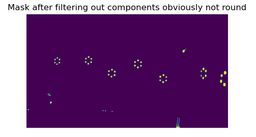
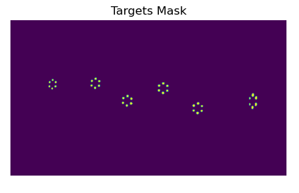
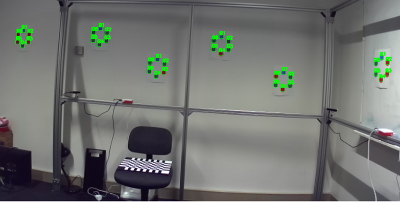

# CITS4402_Proj
# **Project: Automatic calibration of a holographic acquisition rig**

## Table of Contents

  - [Project Title](#cits4402proj)
- [Project Description](#project-automatic-calibration-of-a-holographic-acquisition-rig)
- [Installation](#installation)
  - [Original Image](#original-image)
- [Task 1 – The rough detection](#task-1--the-rough-detection)
  - [[1] Rough Mask](#1-rough-mask)
  - [[2] Area Filtering](#2-area-filtering)
  - [[3] Remove Non-round](#3-remove-non-round)
  - [[4] Calculate Largest Residual Error](#4-calculate-largest-residual-error)
  - [[5] Residual Errors Filtering](#5-residual-errors-filtering)
- [Task 2 – Targets analysis and refinement](#task-2--targets-analysis-and-refinement)
- [Task 3 – Cameras alignments](#task-3--cameras-alignments)

- [GUI Introduction](#gui-introduction)
  - [Main Screen](#main-screen)
  - [User Manual](#user-manual)
- [Authors](#authors)

## Installation
Clone the repository:
```bash
git clone https://github.com/yuliangzhang/CITS4402_Proj.git
```
Install project dependencies: 
```bash
pip install -r requirements.txt
```

### Original Image
[](Figures/Original_Image.png)


## Task 1 – The rough detection
Run Main Python File:
```bash
python3 target_localiztoin.py
```
#### [1] Rough Mask

#### Function:
 [](Figures/mask_function.png)
#### Algorithm: `rough_target_detection`
This function takes an image and applies two conditions to each pixel to create a mask. The conditions involve the minimum threshold of RGB channel values and the difference between the maximum and minimum values.


#### **Result**

[](Figures/Raw_mask.png)

### [2] Area Filtering

#### Function:

[](Figures/Area_Function.png)
#### Algorithm: `area_threshold_filter`
This function filters out connected components (clusters) in the mask that have areas smaller than a minimum threshold or larger than a maximum threshold.

#### **Result**

[](Figures/Filtering_small_large_area.png)

### [3] Remove Non-round

#### Function:

[](Figures/pixel_cluster.png)
#### Algorithm: `axis_ratio_filter`
This function filters out components that are not round enough based on the axis ratio of their shape.


### [4] Calculate Largest Residual Error

#### Algorithm: `get_derivative_matrix` && `get_largest_residual_error`: 
These functions are used to calculate the largest residual error of a matrix.


### **Result**
[](Figures/filtering_out_components_no-round.png)

### [5] Residual Errors Filtering

#### Algorithm: `target_detection`
This function identifies clusters in the mask that can form a six-dot target shape. It uses the KDTree data structure to find the nearest clusters for each selected cluster and applies filters based on residual errors.


### **Result**
[](Figures/Target_Mask.png)

### Note:

For more details see the `target_localiztoin.py` file, which gives clear code splitting and code comments.

## Task 2 – Targets analysis and refinement

### Algorithm: `target_label_align`

This function aligns the labels of the detected targets and computes the weighted centroids of each dot in a target.

### **Result**

[](Figures/Detected_Targets.png)

### Note:
For more details see the `target_localiztoin.py` file, which gives clear code splitting and code comments.

## Task 3 – Cameras alignments
Run Main Python File:
```bash
python3 3d_reconstruction
```

### Algorithm: `get_relative_position`
Used to reconstruct the 3d points from stereo cameras.

[1] **step 1:** select camera 11 left as the reference camera.

[2] **step 2:** use local coordinates of each target to get the position and translation of the camera, and then invert it to get the targets coordinates relative to the reference camera.
local coordinates of each target is :
```angular2html
target_local_coordinate = np.array([
[0, 90.01599884033203, 0],
[77.95613861083984, 45.007999420166016, 0],
[77.95613861083984, -45.007999420166016, 0],
[0, -90.01599884033203, 0],
[-77.95613861083984, -45.007999420166016, 0],
[-77.95613861083984, 45.007999420166016, 0]
])
```
[3] **step 3**: align images with projection of the currently solved target ton the rig frame of reference.

[4] **step 4:** by using the least square optimization algorithm to minimize the projection error of each targets in the images.

### **Result**

### Note:
For more details see the `3d_reconstruction` file, which gives clear code splitting and code comments.


## GUI Introduction
Start the GUI application:

Run GUI Python File: 
```bash
python3 Image_parameter_exploration.py
```
### Main Screen


#### User Manual
**1.** The main screen will appear, featuring the following buttons and scrollbars:

- **Load Image button:** Click this button to load an image for parameter exploration.
- **Target Locate button:** Click this button to perform target detection on the loaded image.

- **Min threshold scrollbar:** Adjust this scrollbar to set the minimum threshold for image processing.
- **Min Area scrollbar:** Adjust this scrollbar to set the minimum area threshold for detected targets.
- **Different threshold scrollbar:** Adjust this scrollbar to set a different threshold for specific image features.
- **Max Area scrollbar:** Adjust this scrollbar to set the maximum area threshold for detected targets.
- **Axis ratio threshold scrollbar:** Adjust this scrollbar to set the axis ratio threshold for detected targets.
- **Ellipses threshold scrollbar:** Adjust this scrollbar to set the ellipses threshold for detected targets.

**2.** Explore different parameter settings by adjusting the scrollbars and clicking the Target Locate button to observe the effects on target detection.

**3.** Experiment with various image files and parameter combinations to refine target detection results.

### Note:
For more details see the `Image_parameter_exploration.py` file, which gives clear code splitting and code comments.

## Authors
- [yuliang.zhang@research.uwa.edu.au](mailto:yuliang.zhang@research.uwa.edu.au)(**Yuliang Zhang**)

- [22910358@student.uwa.edu.au](mailto:22910358@student.uwa.edu.au)(**Yu Liu**)

- [juwita.juwita@research.uwa.edu.au](juwita.juwita@research.uwa.edu.au)(**Juwita**).

