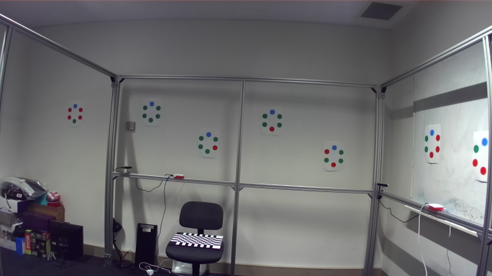
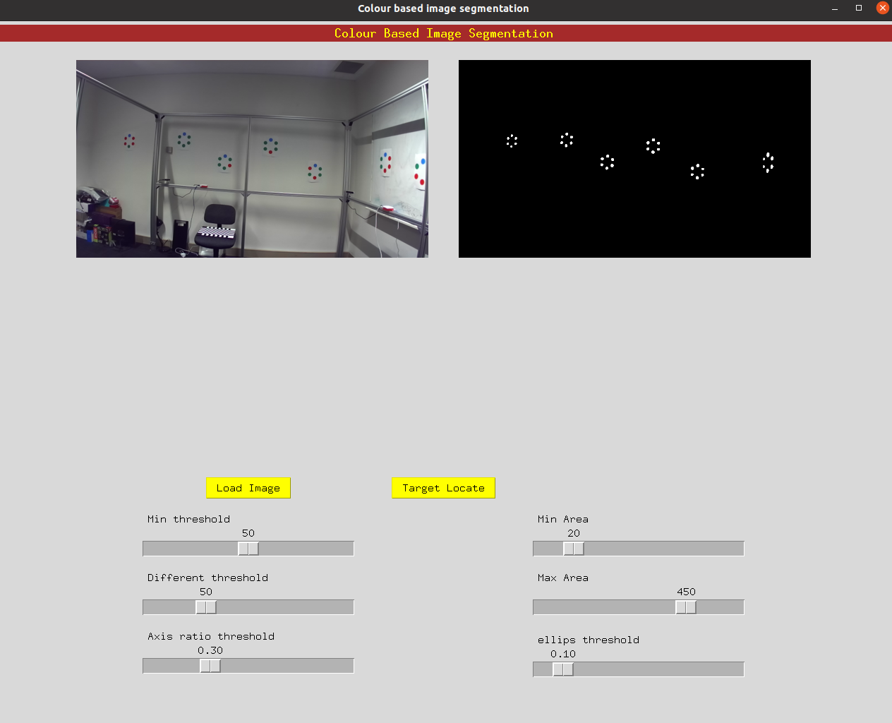

# CITS4402_Proj
# **Project: Automatic calibration of a holographic acquisition rig**

## Table of Contents

- [Project Title](#project-title)
- [Project Description](#project-description)
- [Installation](#installation)
- [Experiment Data](#experiment-data)
  - [Original Image](#original-image)
  - [Task 1 – The rough detection](#task-1--the-rough-detection)
    - [Rough Mask](#rough-mask)
    - [Area Filtering](#area-filtering)
    - [Remove Non-round](#remove-non-round)
    - [Target Mask](#target-mask)
  - [Task 2 – Targets analysis and refinement](#task-2--targets-analysis-and-refinement)
- [GUI Introduction](#gui-introduction)
  - [Main Screen](#main-screen)
  - [User Manual](#user-manual)
- [Authors](#authors)

## Installation
Clone the repository:
```bash
git clone https://github.com/yuliangzhang/CITS4402_Proj.git
```
Install project dependencies: 
```bash
pip install -r requirements.txt
```


## Experiment Data
Run Main Python File:
```bash
python3 target_localiztoin.py`
```
#### Original Image
[](Figures/Original_Image.png)


### Task 1 – The rough detection

#### Rough Mask

##### Function:

 [](Figures/mask_function.png)

##### Output:

[](Figures/Raw_mask.png)

#### Area Filtering

##### Function:

[](Figures/Area_Function.png)

#####  Output:

[](Figures/Filtering_small_large_area.png)

#### Remove Non-round

##### Function:

[](Figures/pixel_cluster.png)

#### Output:
[](Figures/filtering_out_components_no-round.png)

#### Target Mask
[](Figures/Target_Mask.png)


### Task 2 – Targets analysis and refinement
[](Figures/Detected_Targets.png)

## GUI Introduction
Start the GUI application:

Run GUI Python File: 
```bash
python3 Image_parameter_exploration.py
```
#### Main Screen

[](Figures/GUI.png)

#### User Manual
**1.** The main screen will appear, featuring the following buttons and scrollbars:

- **Load Image button:** Click this button to load an image for parameter exploration.
- **Target Locate button:** Click this button to perform target detection on the loaded image.

- **Min threshold scrollbar:** Adjust this scrollbar to set the minimum threshold for image processing.
- **Min Area scrollbar:** Adjust this scrollbar to set the minimum area threshold for detected targets.
- **Different threshold scrollbar:** Adjust this scrollbar to set a different threshold for specific image features.
- **Max Area scrollbar:** Adjust this scrollbar to set the maximum area threshold for detected targets.
- **Axis ratio threshold scrollbar:** Adjust this scrollbar to set the axis ratio threshold for detected targets.
- **Ellipses threshold scrollbar:** Adjust this scrollbar to set the ellipses threshold for detected targets.

**2.** Explore different parameter settings by adjusting the scrollbars and clicking the Target Locate button to observe the effects on target detection.

**3.** Experiment with various image files and parameter combinations to refine target detection results.

## Authors
- [22672987@student.uwa.edu.au](mailto:22728187@student.uwa.edu.au)(**Yuliang Zhang**)

- [22910358@student.uwa.edu.au](mailto:22910358@student.uwa.edu.au)(**Yu Liu**)

- [22200099@student.uwa.edu.au](mailto:22200099@student.uwa.edu.au)(**Juwita**).

